---

# Facial Attendance System

Welcome to the **Facial Attendance System** repository! This project is a modern, interactive, and efficient attendance management system built using **Django**, **OpenCV**, and **SQLite**. It leverages facial recognition technology to automate attendance tracking, making it ideal for classrooms, offices, or any environment where attendance needs to be recorded.

## Features

- **Facial Recognition**: Uses OpenCV and face recognition libraries to detect and recognize faces in real-time.
- **Django Backend**: A robust and scalable web framework to manage users, attendance records, and system settings.
- **SQLite Database**: Lightweight and efficient database to store user profiles, attendance logs, and system data.
- **Interactive Dashboard**: Modern and user-friendly dashboard with statistical charts for attendance analysis.
- **Real-Time Attendance Tracking**: Mark attendance in real-time using a webcam.
- **Export Attendance**: Export attendance records to CSV or Excel for further analysis.

---

## Table of Contents

1. [Installation](#installation)
2. [Usage](#usage)
3. [Features in Detail](#features-in-detail)
4. [Statistical Charts](#statistical-charts)
5. [Contributing](#contributing)
6. [License](#license)

---

## Installation

Follow these steps to set up the Facial Attendance System on your local machine:

1. **Clone the Repository**:
   ```bash
   git clone https://github.com/vendotha/facial-attendance-system.git
   cd facial-attendance-system
   ```

2. **Set Up a Virtual Environment**:
   ```bash
   python -m venv venv
   source venv/bin/activate  # On Windows: venv\Scripts\activate
   ```

3. **Install Dependencies**:
   ```bash
   pip install -r requirements.txt
   ```

4. **Run Migrations**:
   ```bash
   python manage.py migrate
   ```

5. **Create a Superuser**:
   ```bash
   python manage.py createsuperuser
   ```

6. **Run the Development Server**:
   ```bash
   python manage.py runserver
   ```

7. **Access the System**:
   Open your browser and navigate to `http://127.0.0.1:8000`.

---

## Usage

1. **Admin Dashboard**:
   - Log in as an admin to manage users, view attendance records, and generate reports.
   - Access the admin panel at `http://127.0.0.1:8000/admin`.

2. **Mark Attendance**:
   - Use the "Mark Attendance" feature to capture faces via webcam and record attendance in real-time.

3. **View Reports**:
   - Navigate to the "Reports" section to view attendance statistics and export data.

---

## Features in Detail

### 1. Facial Recognition
- The system uses **OpenCV** and **face_recognition** libraries to detect and recognize faces.
- Facial encodings are stored in the database for quick and accurate recognition.

### 2. Django Backend
- **User Management**: Add, update, or delete users.
- **Attendance Logs**: View and manage attendance records.
- **Settings**: Configure system settings like attendance thresholds and recognition accuracy.

### 3. SQLite Database
- Stores user profiles, facial encodings, and attendance logs.
- Lightweight and easy to set up.

### 4. Interactive Dashboard
- Modern UI with charts and graphs for visualizing attendance data.

---

## Statistical Charts

The system includes an interactive dashboard with statistical charts to help you analyze attendance data. Below are some examples of the charts you can generate using **Mermaid**:

### 1. Daily Attendance Trend
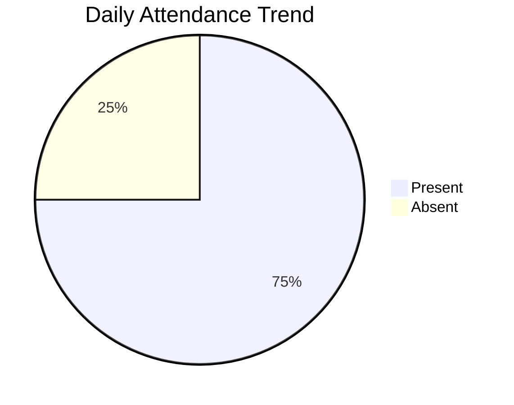

### 2. Monthly Attendance Summary
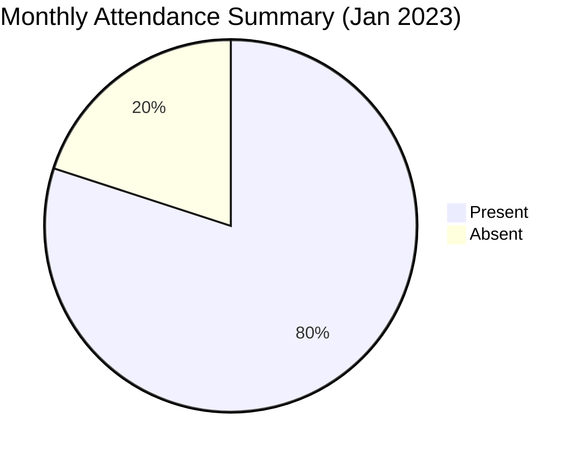

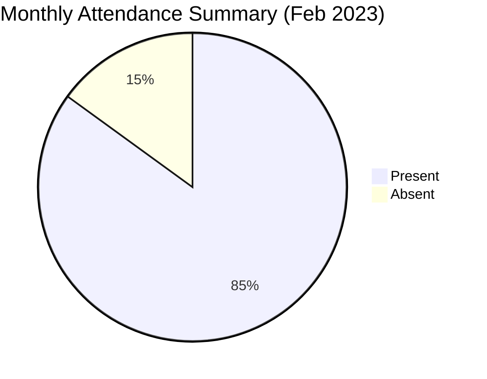

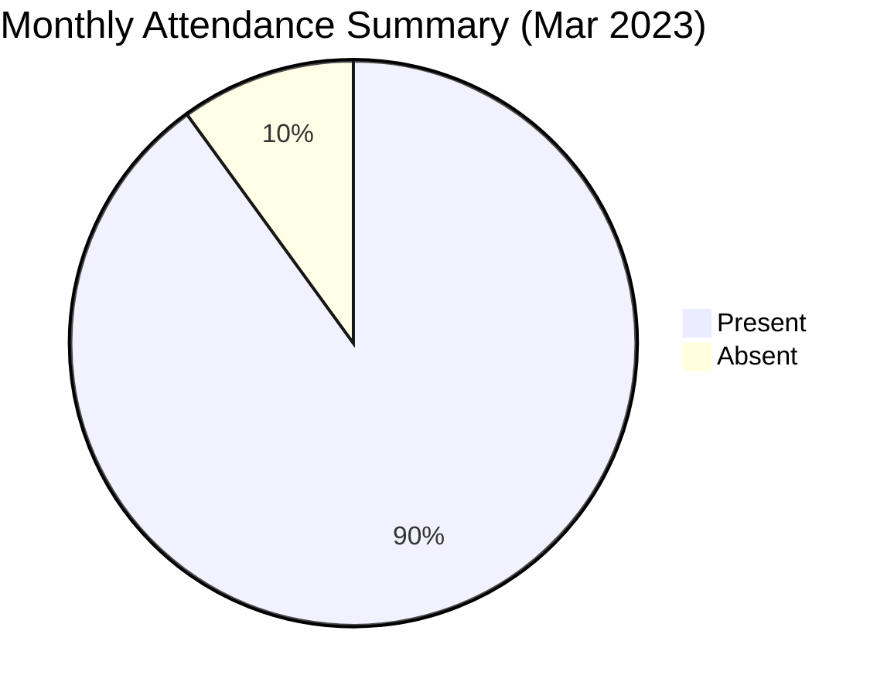

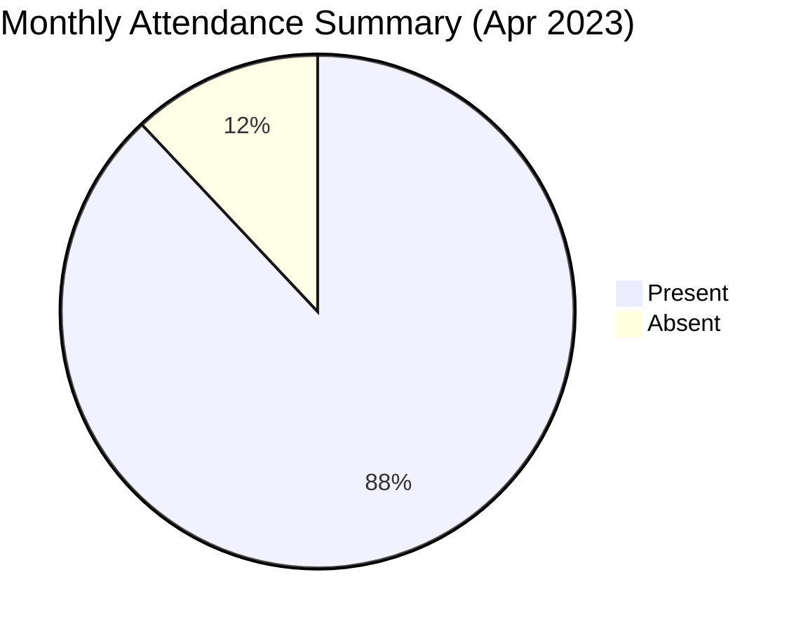

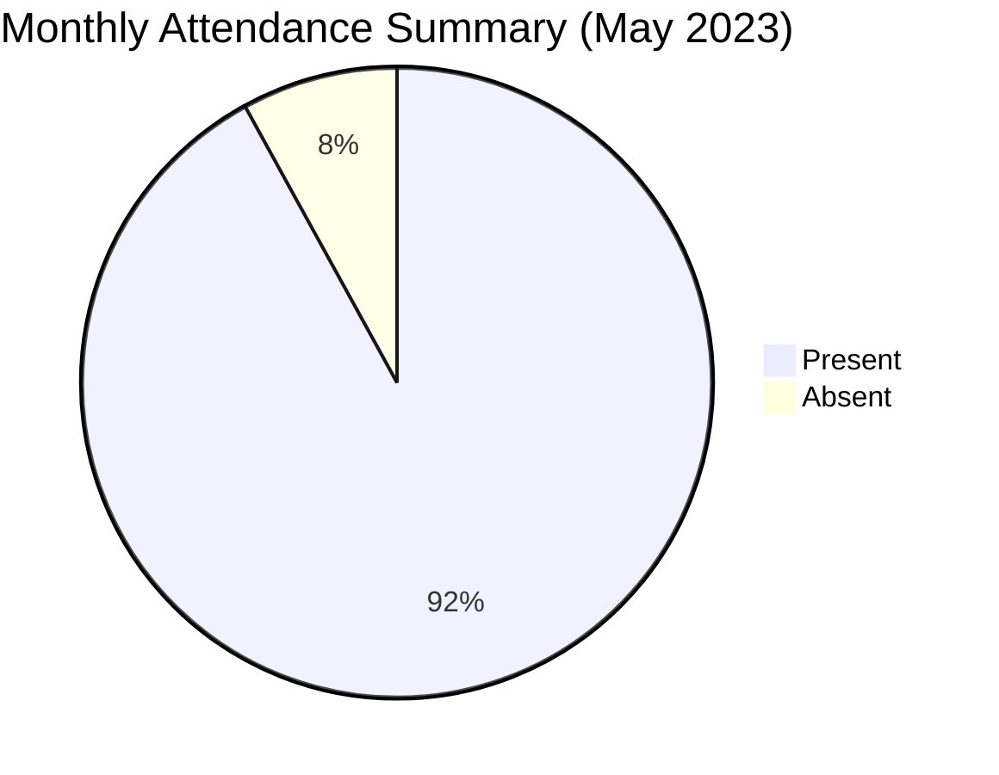

### 3. User-wise Attendance
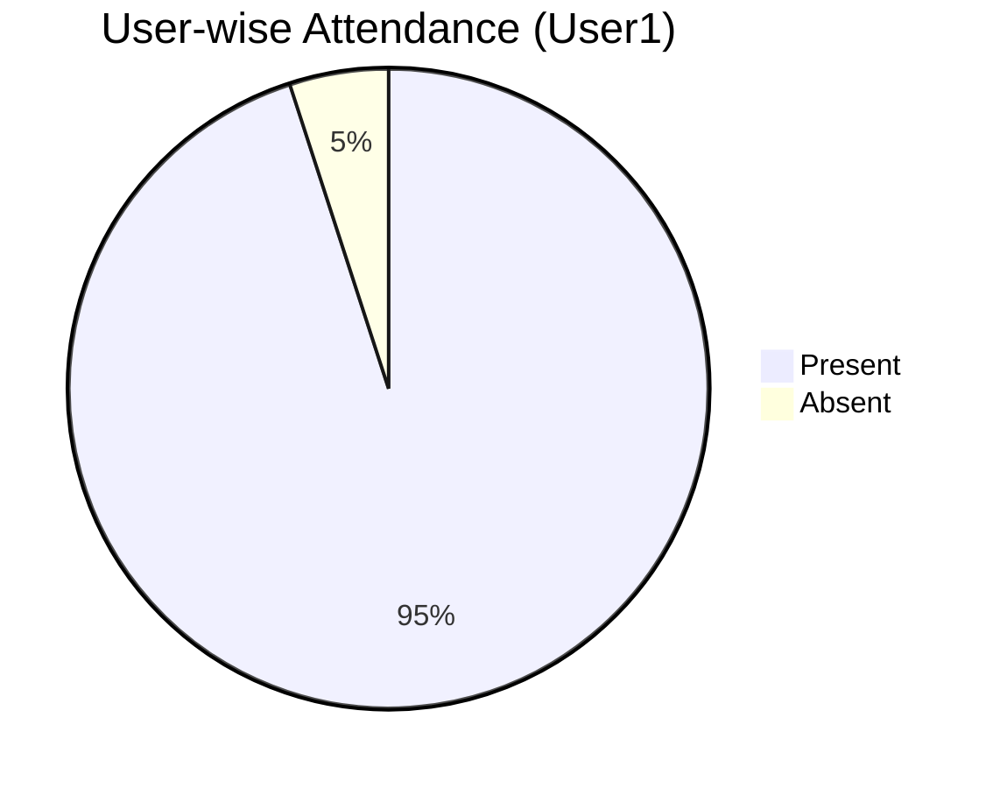

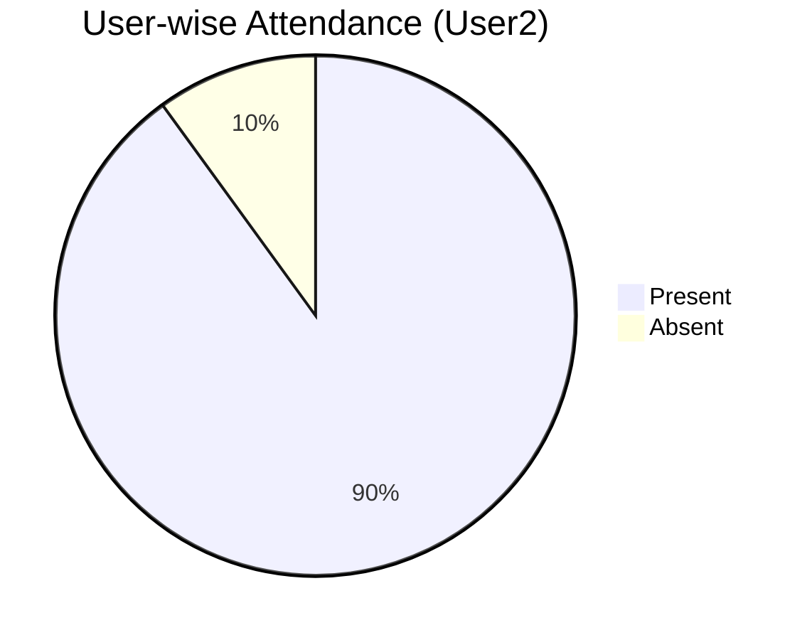

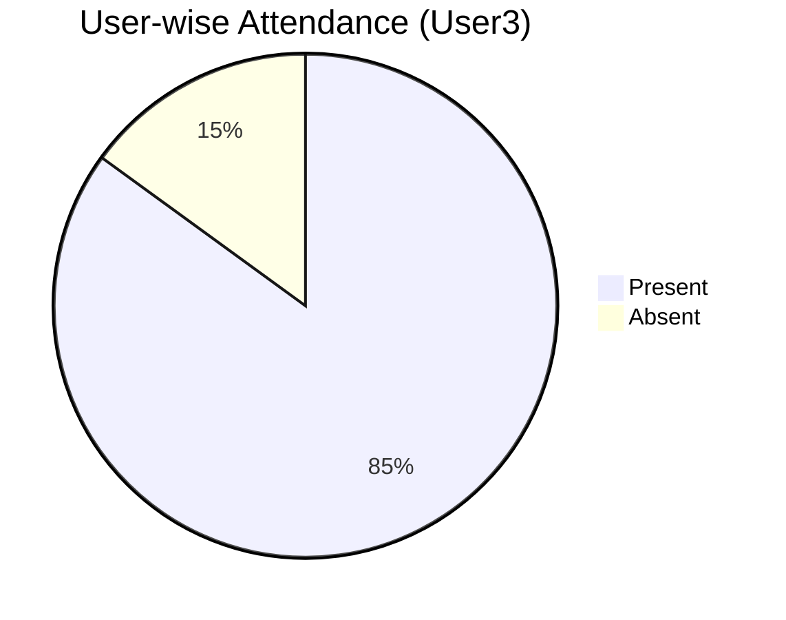

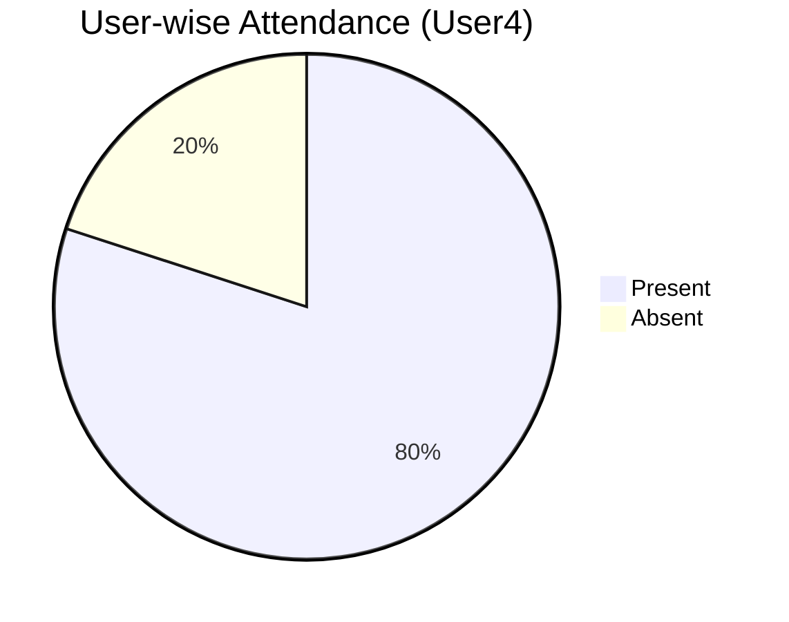

### 4. Recognition Accuracy
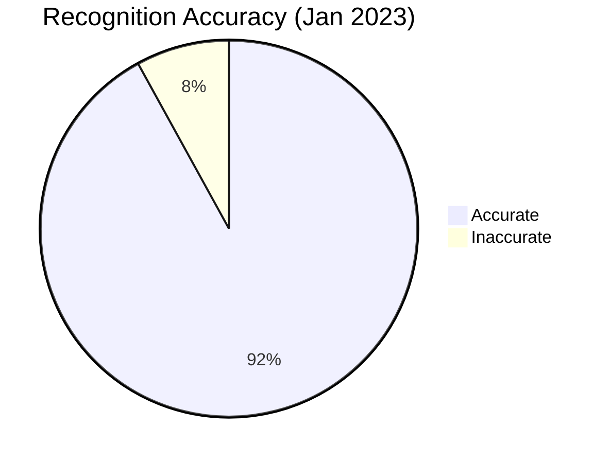

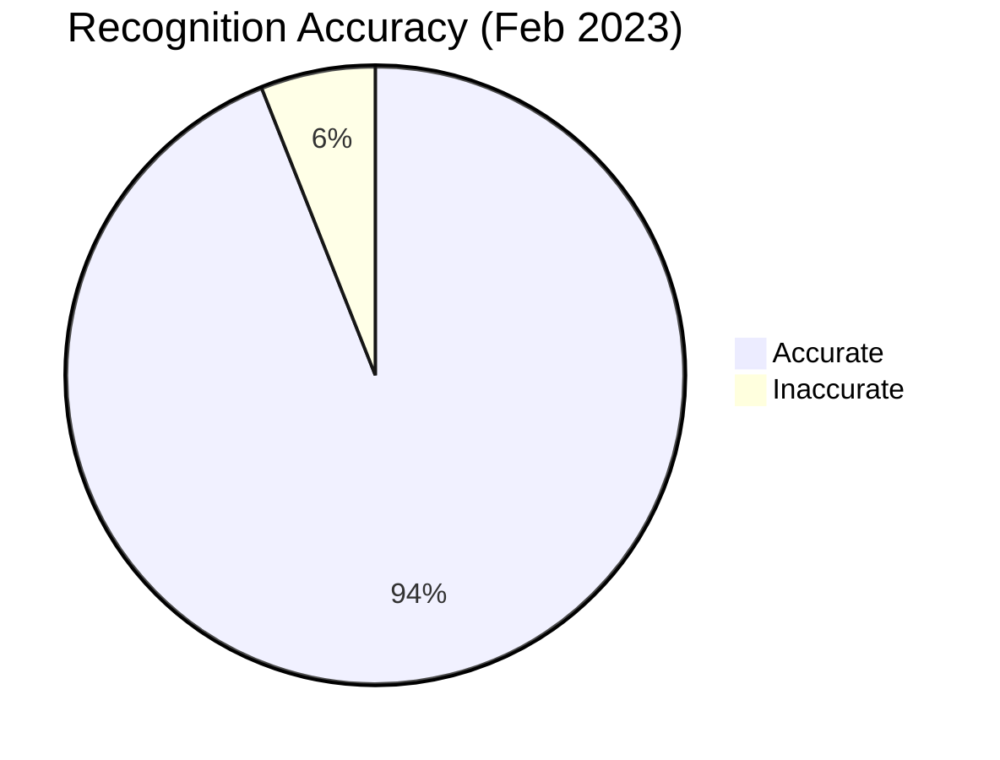


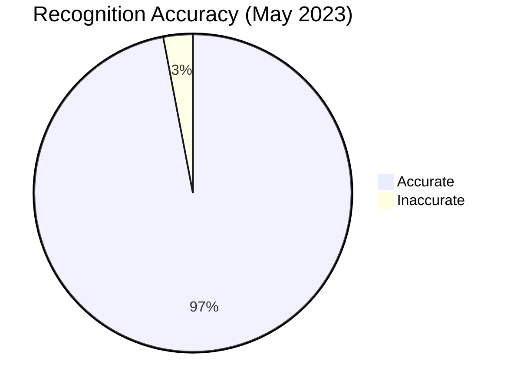

---

## Contributing

We welcome contributions! If you'd like to contribute to this project, please follow these steps:

1. Fork the repository.
2. Create a new branch (`git checkout -b feature/YourFeatureName`).
3. Commit your changes (`git commit -m 'Add some feature'`).
4. Push to the branch (`git push origin feature/YourFeatureName`).
5. Open a pull request.

---

## License

This project is licensed under the MIT License. See the [LICENSE](LICENSE) file for details.

---

## Acknowledgments

- **OpenCV**: For providing the tools for real-time face detection and recognition.
- **Django**: For the robust backend framework.
- **Mermaid**: For the interactive and modern statistical charts.

---

## Contact

For any questions or feedback, feel free to reach out:

- **Name**: Buvananand Vendotha
- **Email**: [vendotha@gmail.com](mailto:vendotha@gmail.com)
- **LinkedIn**: [vendotha](https://www.linkedin.com/in/vendotha/)
- **GitHub**: [vendotha](https://github.com/vendotha)

---

Thank you for using the **Facial Attendance System**! We hope it simplifies your attendance management process. 🚀

---
